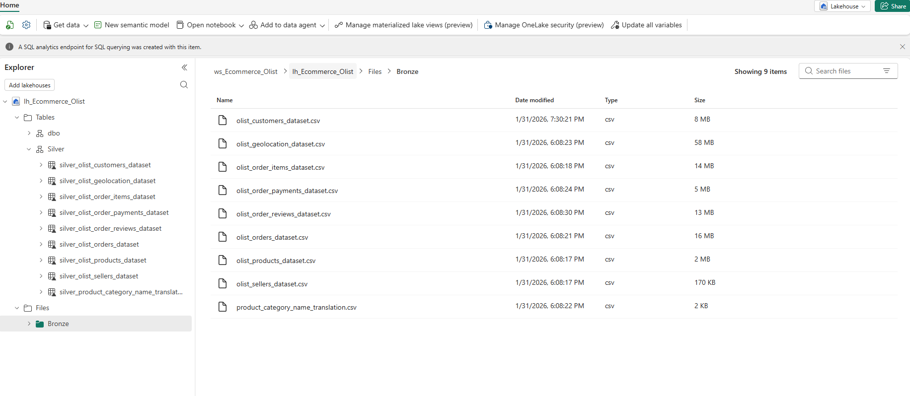
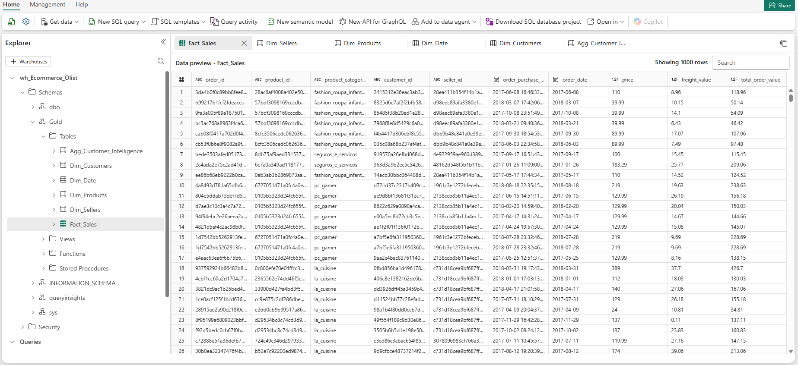
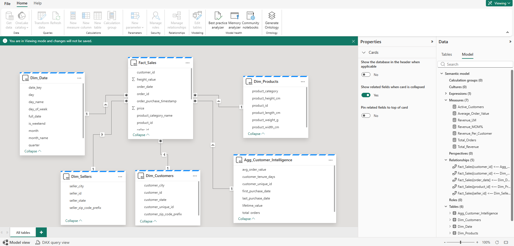
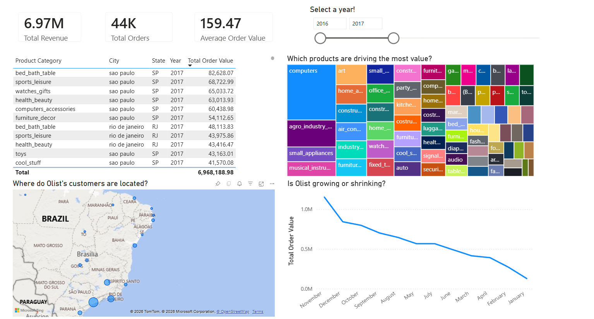

# Brazilian E-commerce Olist Analytics using a Medallion Architecture

## 📋 Project Overview
This project implements a comprehensive Data Engineering and Analytics solution using Microsoft Fabric. It transforms raw Brazilian E-commerce data (Olist) from a flat-file structure into a high-performance Star Schema optimized for executive reporting.

The solution demonstrates the "Best of Both Worlds" approach: using a Lakehouse for scalable Spark-based data cleaning and a Data Warehouse for structured T-SQL modeling and Power BI integration.

## 🧱 Architecture & Data Flow
The project follows the Medallion Architecture to ensure data quality and lineage:

**Ingestion (Bronze):** Raw CSV files are ingested from GitHub into a Fabric Lakehouse using Data Factory Pipelines.

**Transformation (Silver):** Data is cleaned, typed, and deduplicated using PySpark Notebooks. Tables are organized into a dedicated Silver schema within the Lakehouse.

**Modeling (Gold):** Cleaned data is surfaced in a Fabric Warehouse. Using T-SQL, we build a Star Schema comprising:

**Fact_Sales:** Transactional data with pre-calculated total values.

**Dimension Tables:** Dim_Customers, Dim_Products (with English translations), Dim_Sellers, and a custom Dim_Date.

**Aggregated Views:** A Gold.Agg_Customer_Intelligence table for Customer Lifetime Value (CLV) analysis.

**Visualization:** A Custom Semantic Model connects the Gold layer to Power BI via Direct Lake mode for sub-second report performance.

## 🚀 Key Features
**Cross-Database Querying:** Seamlessly joining Spark-managed Delta tables with T-SQL Warehouse tables.

**Star Schema Design:** Optimized for Power BI performance and ease of use.

T**ime Intelligence:** A custom-built Date Dimension supporting MoM and YTD metrics.

**Direct Lake Connectivity:** Eliminates the need for traditional Power BI dataset refreshes.

**Customer Intelligence:** Advanced logic to calculate CLV and purchase frequency.

## 📈 Analytics & DAX Measures
The project includes a centralized _Measures table containing essential business logic:

**Total Revenue:** Total sales including shipping costs.

**MoM Growth:** Monthly percentage change in revenue.

**Average Ticket:** Revenue per order.

**Active Customers:** Unique purchasing entities.

## 🛠️ Tech Stack
**Orchestration:** Microsoft Fabric Data Factory

**Processing:** PySpark (Fabric Notebooks)

**Storage:** OneLake (Delta Lake format)

**Data Warehousing:** Microsoft Fabric Synapse Data Warehouse

**Business Intelligence:** Power BI (Direct Lake)

## 🔮 Future Roadmap
Implement `Row-Level Security (RLS)` to restrict seller data access.

Add `Data Activator alerts` for significant sales spikes or drops.

Incorporate `Machine Learning` for `Churn Prediction`using Fabric's integrated Synapse ML.
