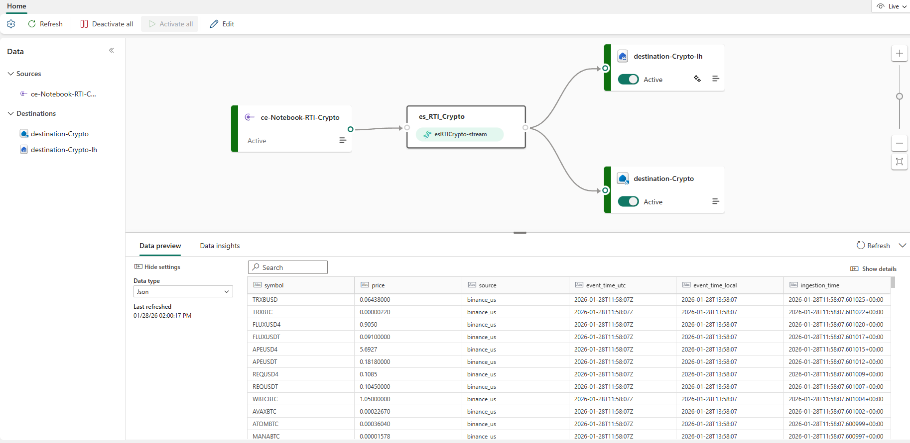
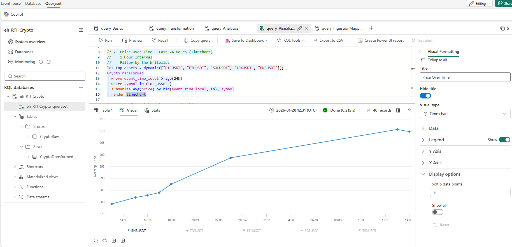
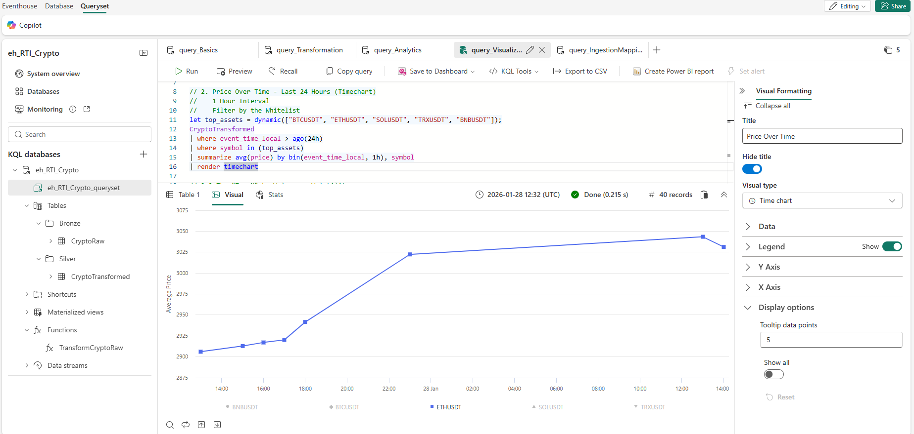
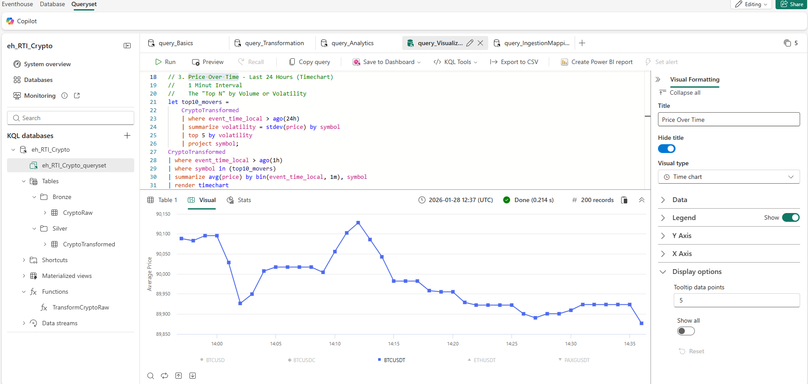
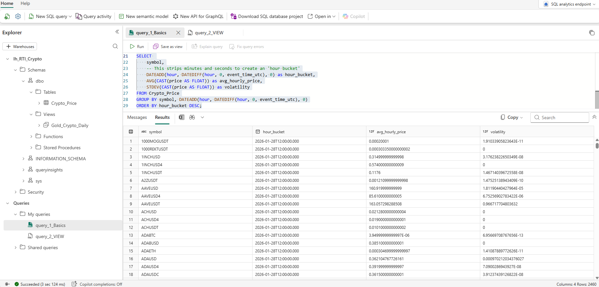
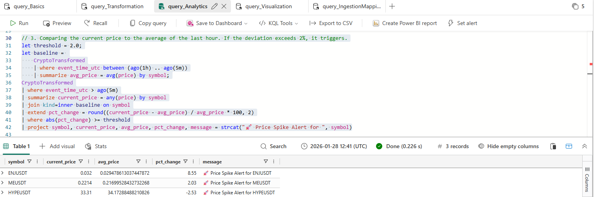
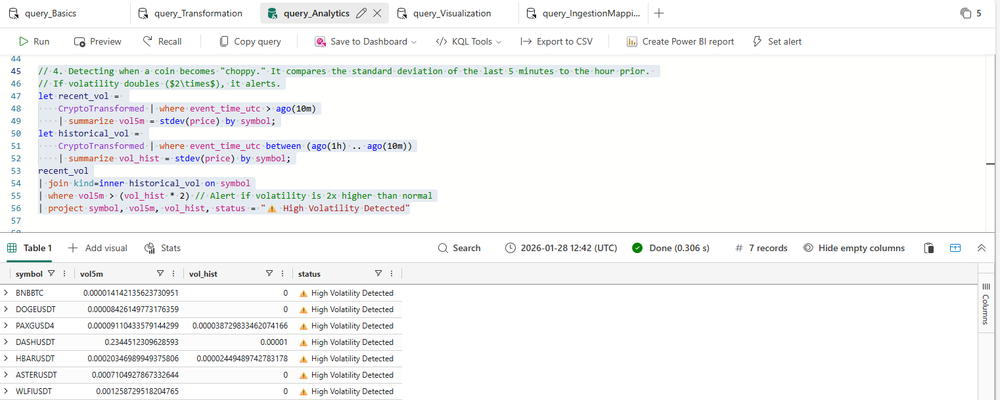

# 📈 Real-Time Crypto Market Intelligence Platform 

## Overview
This project demonstrates an **end-to-end real-time streaming intelligence solution** built using **Microsoft Fabric Real-Time Intelligence**.  
The system ingests live cryptocurrency price data from the **Binance US public API** every few seconds, processes it in real time, stores it for historical analysis, and enables **real-time analytics, anomaly detection, and visualization**.

The goal of this project is to showcase **production-oriented streaming architecture**, **event-driven analytics**, and **Microsoft Fabric RTI capabilities** in a single, cohesive solution.

---

## 🚀 Key Features
- **Live data ingestion** from a public REST API (Binance US)
- **Near real-time streaming** (2-second refresh rate)
- **Event-driven architecture** using Fabric Eventstreams
- **Real-time analytics** using KQL Database
- **Historical storage** in OneLake (Lakehouse)
- **Anomaly detection & price movement analysis**
- **Interactive dashboards** (Real-Time Dashboard / Power BI)

---

## 🧱 Architecture Overview

**Data Flow:**

---

## 📈 Visualization

The project includes:

- Live price tickers

- Top movers by percentage change

- Real-time line charts

- Historical trend analysis

Dashboards are powered by Fabric Real-Time Dashboards and Power BI.

---

## 🔔 Alerts & Monitoring

- Price spike alerts (> ±2%)

- Missing data detection

- High volatility notifications

---

## 🧠 Key Takeaways

- This project highlights:

- End-to-end real-time streaming architecture

- Event-driven analytics with KQL

- Practical use of Microsoft Fabric for real-time intelligence

- Production-oriented thinking beyond basic data ingestion

---

## 🔮 Future Improvements

- Advanced anomaly detection models

- Cost optimization strategies

- Machine learning-based trend prediction